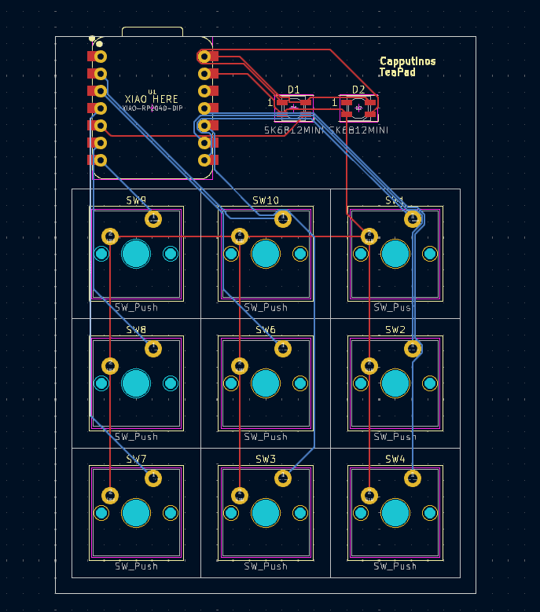
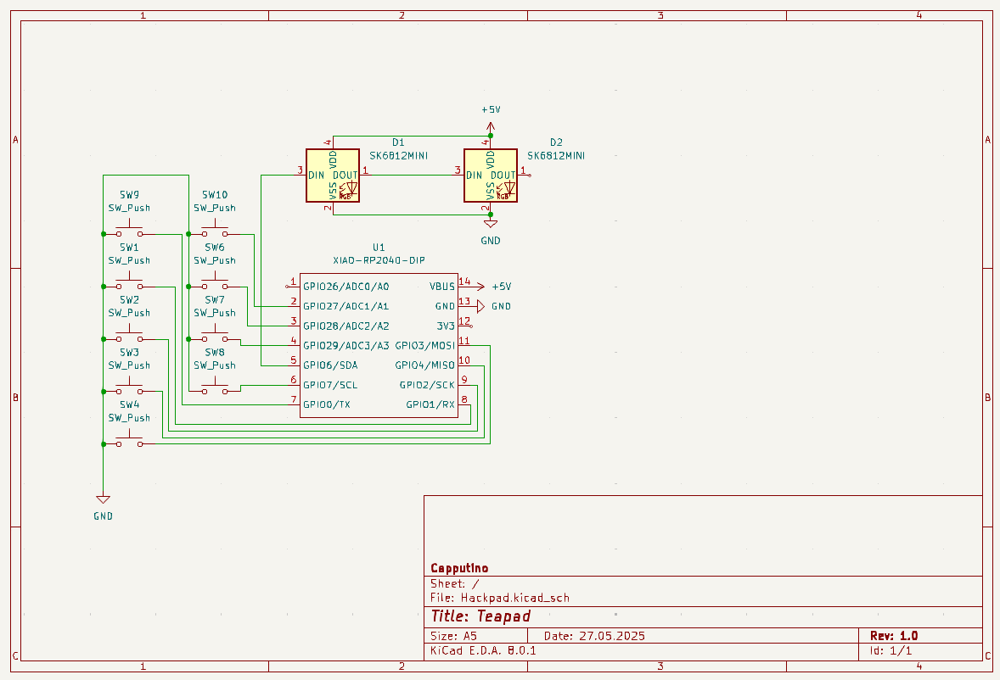

# 🫖 Teapad 🫖
Teapad is a KMK based 3 by 3 macropad in the shape of a teapod.

This project is based of the amazing [Hackclub Hackpad](https://hackpad.hackclub.com/submitting) template.

## CAD Model
The Case is held together by 6 M3 Bolts and nuts.
Printable Parts are located in the [production directory](https://github.com/Eisbaer1832/Teapad/tree/main/production).

## PCB
The PCB was created in KiCad, source Files are located in the [PCB directory](https://github.com/Eisbaer1832/Teapad/tree/main/PCB).

## Firmware
At the moment, the KMK firmware just calls Shortcuts I use for voice chatting or music and opens some programms via the os lib. 
Customizable QT Frontend to change these and implement LED Status codes is comming soon ™️.

## BOM
* 1x Seeed XIAO RP2040
* 2x Through-hole 1N4148 Diodes
* 9x Cherry MX Switches
* 9x DSA keycaps
* 6x M3x16mm screws
* 6x M3 nuts (self provided)
* 1x Case (1x Top, 1x Bottom)
